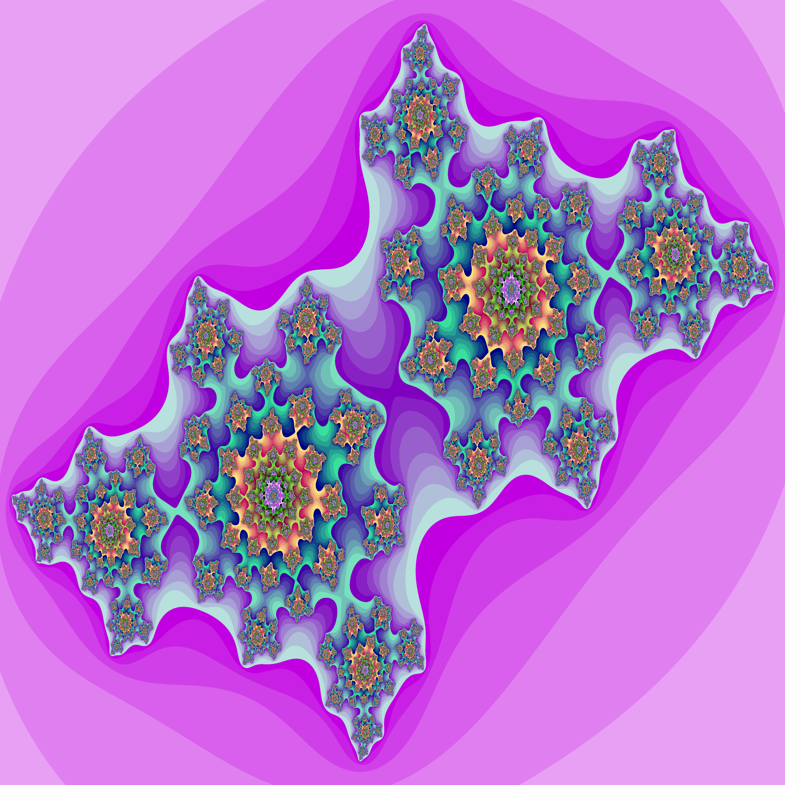
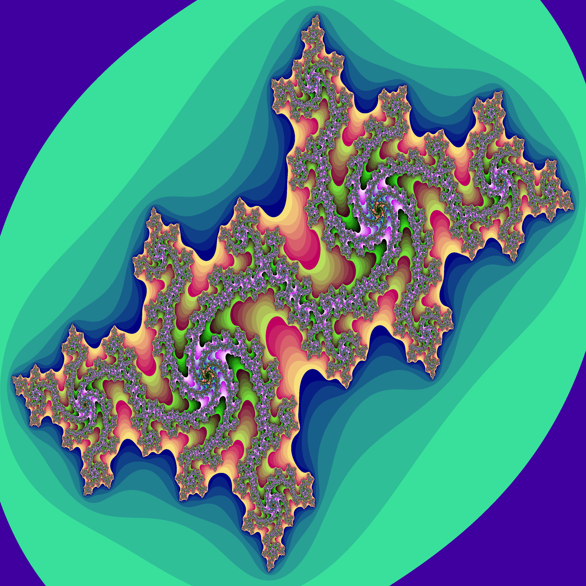
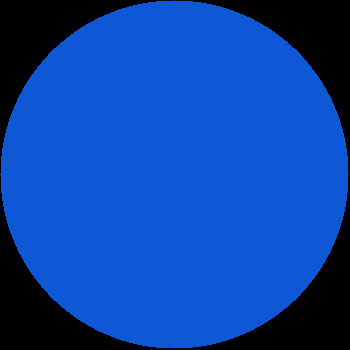

# Turtle
A Generative Art tool in Rust!



This was inspired by [Isaacg1's Programatically Generated Artwork](https://isaacg1.github.io/2018/12/06/programmatically-generated-artwork.html).

## Build & Run

### Installation via cargo

Make sure you have [Rust](https://www.rust-lang.org/tools/install) and Cargo installed.

Install this project on any platform using Cargo:

```console
$ cargo install --git https://github.com/wcygan/turtle
```

### How to run
```console
$ turtle -s <size> -n <name> -p <pattern>
```
## Options

The program options that can be used:

| Option      | Usage                                                                       | Example            |
| :---------- | :---------------------------------------------------------------------------| :----------------- |
| `-s`        | Number of pixels, N, to create an N x N image                               | `-s 10`            |
| `-r`        | Seed used to initialize a pseudorandom number generator                     | `-r 1234`          |
| `-n`        | Name of the output file                                                     | `-n foo`           |
| `-p`        | Image pattern to use                                                        | `-p square`        |
| `-x`        | Imaginary part of a complex number                                          | `-x -0.55`         |
| `-y`        | Real part of a complex number                                               | `-y 0.53`          |
| `-i`        | Number of times to executed iterated algorithms                             | `-i 105`           |


## Output Examples

### Julia Set
```console
$ turtle -n julia-fractal -p julia-fractal -s 3000 -x -0.55 -y 0.53 -i 105
```


### Square
```console
$ turtle --size 350 --name square --pattern square --rng 2121
```


### Circle
```console
$ turtle -s 350 -n circle -p circle -r 99479
```


### Supported patterns:
- Square
- Circle
- Julia Fractal

### Upcoming patterns:
- Mandelbrot Fractal
- ... more complex patterns soon!

## Dependencies
- [clap](https://docs.rs/clap/2.33.3/clap/) to parse commands
- [image](https://docs.rs/image) to create images
- [rand](https://docs.rs/rand) to generate pseudorandom numbers
- [rayon](https://docs.rs/rayon/1.5.0/rayon/) to parallelize execution