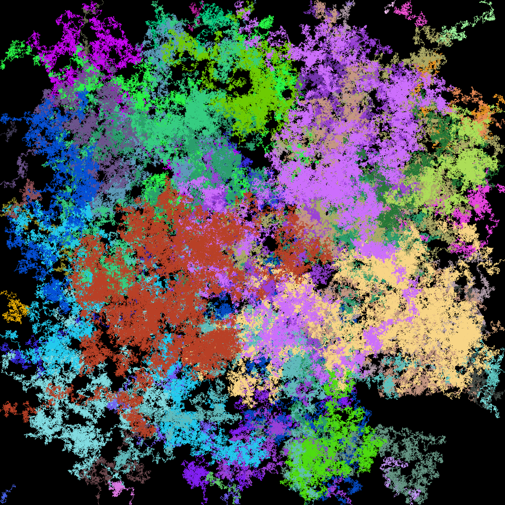
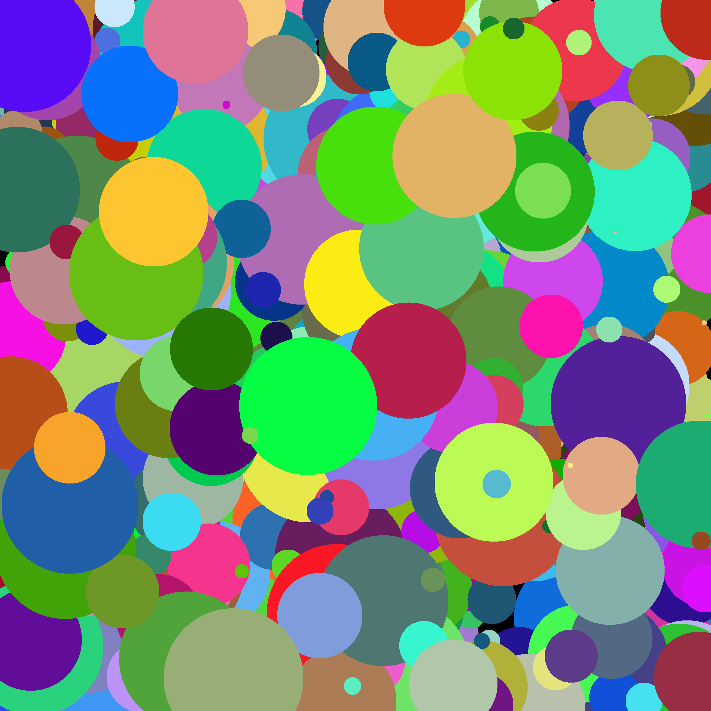
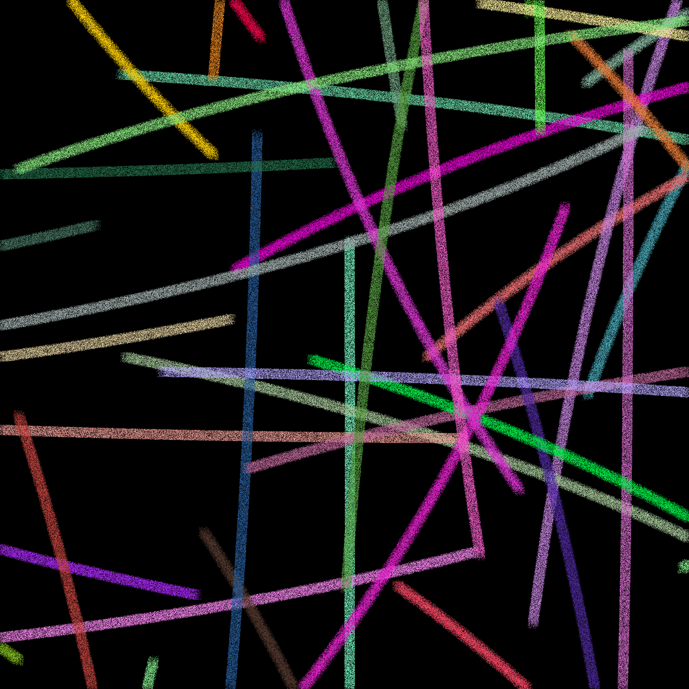
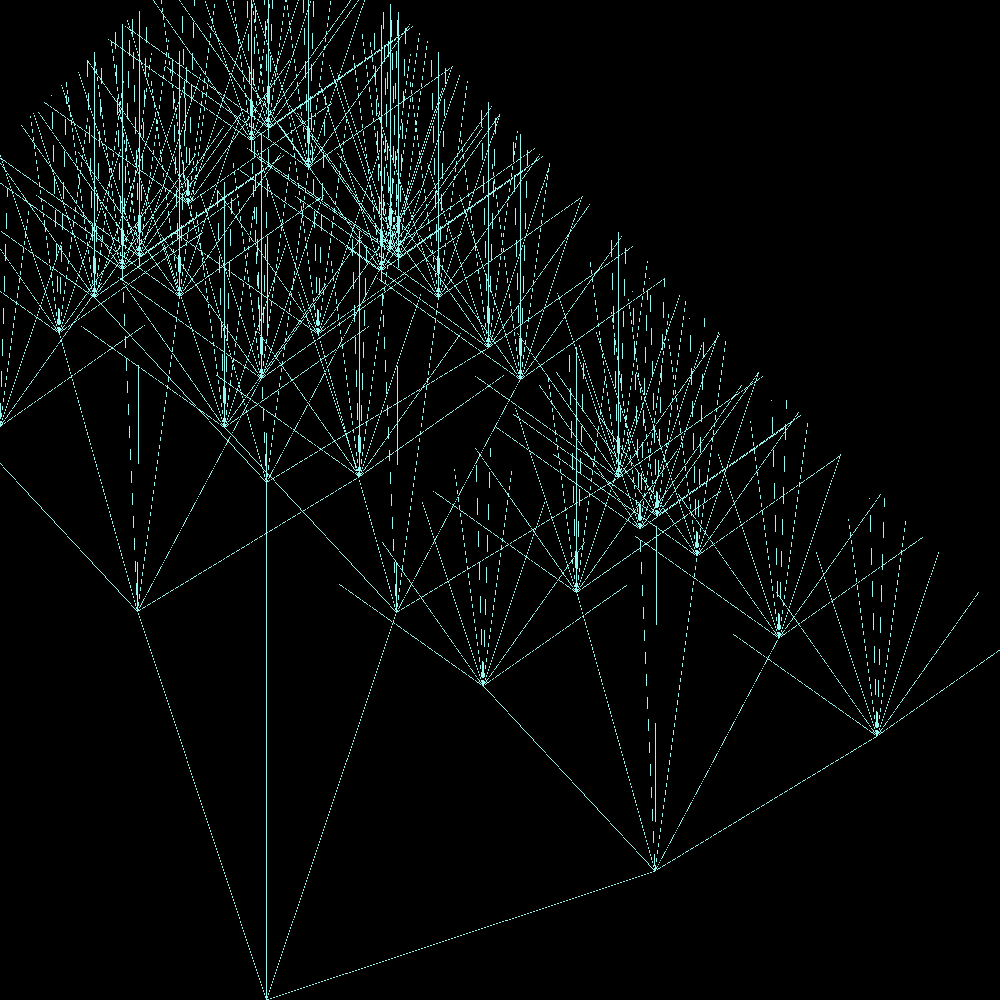
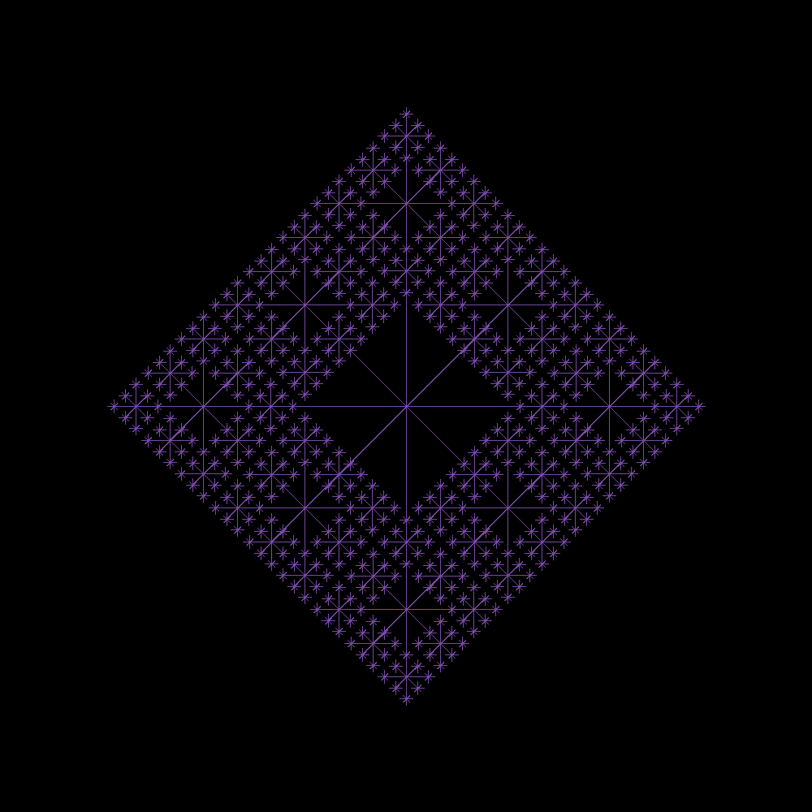
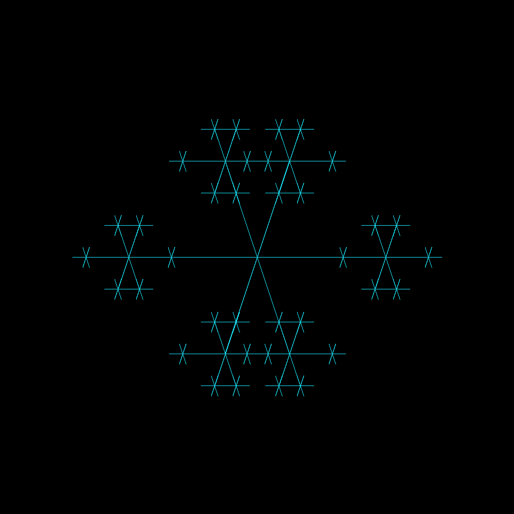

# Turtle

A Generative Art tool in Rust!


This was inspired
by [Isaacg1's Programatically Generated Artwork](https://isaacg1.github.io/2018/12/06/programmatically-generated-artwork.html)
.

## Build & Run

### Installation via cargo

Make sure you have [Rust](https://www.rust-lang.org/tools/install) and Cargo installed.

Install this project on any platform using Cargo:

```console
$ cargo install --git https://github.com/wcygan/turtle
```

### How to run

```console
$ turtle -s <size> -n <name> -p <pattern>
```

## Options

The program options that can be used:

| Option      | Usage                                                                       | Example            |
| :---------- | :---------------------------------------------------------------------------| :----------------- |
| `-s`        | Number of pixels, N, to create an N x N image                               | `-s 10`            |
| `-r`        | Seed used to initialize a pseudorandom number generator                     | `-r 1234`          |
| `-n`        | Name of the output file                                                     | `-n foo`           |
| `-p`        | Image pattern to use                                                        | `-p square`        |
| `-x`        | Imaginary part of a complex number                                          | `-x -0.55`         |
| `-y`        | Real part of a complex number                                               | `-y 0.53`          |
| `-i`        | Number of times to executed iterated algorithms                             | `-i 105`           |

## Output Examples

### Mandelbrot Set

```console
$ turtle -n mandelbrot-fractal -p mandelbrot-fractal -s 8000 -x -0.5 -y 0.5 -i 104
```


### Julia Set

```console
$ turtle -n julia-fractal -p julia-fractal -s 3000 -x -0.55 -y 0.53 -i 105
```


### Squiggly

```console
$ turtle --pattern squiggly --name bar --size 1500
```



### Julia Weird

```console
$ turtle -n julia-weird -p julia-weird -s 8000 -x -0.596 -y 0.555 -i 60
```


### Blobs

```console
$ turtle --name blobs --pattern blobs --rng 14415323423445943 --size 3000
```



### Airbrush

```console
$ turtle --pattern airbrush --name airbrush --size 2000
```



### Tree

```console
$ turtle --size 2000 --pattern tree --rng 12 --name tree
```



### Diamond

```console
$ turtle --size 1000 --name diamond --pattern diamond --rng 124331
```



### Snowflake

```console
$ turtle --size 1000 --name snowflake --pattern snowflake --rng 12494213
```



### Pixels

```console
$ turtle --name pixels --size 2000 --pattern pixels
```


### Square

```console
$ turtle --size 350 --name square --pattern square --rng 2121
```


### Circle

```console
$ turtle --size 350 --name circle --pattern circle --radius 99479
```


## Dependencies

- [clap](https://docs.rs/clap/2.33.3/clap/) to parse commands
- [image](https://docs.rs/image) to create images
- [rand](https://docs.rs/rand) to generate pseudorandom numbers
- [rayon](https://docs.rs/rayon/1.5.0/rayon/) to parallelize execution
- [num-complex](https://docs.rs/num-complex) for complex math'

## Directory Tree

```
$ tree
.
├── Cargo.lock
├── Cargo.toml
├── examples
│   ├── airbrush.png
│   ├── blobs.png
│   ├── circle.png
│   ├── diamond.png
│   ├── julia-fractal.png
│   ├── julia-weird.png
│   ├── mandelbrot-fractal.png
│   ├── pixels.png
│   ├── snowflake.png
│   ├── square.png
│   ├── squiggly.png
│   └── tree.png
├── readme.md
└── src
    ├── algorithms
    │   ├── airbrush.rs
    │   ├── blobs.rs
    │   ├── circle.rs
    │   ├── diamond.rs
    │   ├── julia_fractal.rs
    │   ├── mandelbrot_fractal.rs
    │   ├── mod.rs
    │   ├── pixels.rs
    │   ├── snowflake.rs
    │   ├── square.rs
    │   ├── squiggly.rs
    │   └── tree.rs
    ├── arguments.rs
    ├── dispatcher.rs
    └── main.rs
```